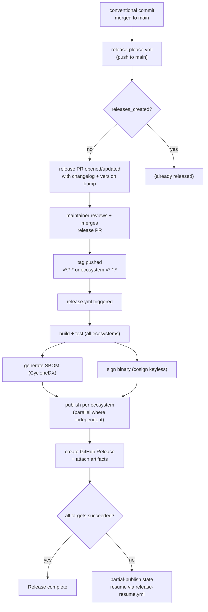

# CI/CD

> Status: foundation slice. Updated each plan increment.
> Last reviewed: 2026-04-24. Owner: Release Engineer.

GitHub Actions is the single quality gate and release control plane for ai-heeczer.
All third-party Actions are pinned to 40-character commit SHAs per [AGENT_HARNESS §5](../agents/AGENT_HARNESS.md).
`workflow-defuser.yml` keeps those pins current automatically.

References: [ADR-0009](../adr/0009-release-control-plane.md), [plan 0012](../plan/0012-cicd-release.md)

---

## Workflow catalog

| Workflow file          | Trigger                        | Purpose                                              | Status |
| ---------------------- | ------------------------------ | ---------------------------------------------------- | ------ |
| `ci.yml`               | push to `main`, all PRs        | Rust fmt/clippy/test; JS typecheck/vitest; Python mypy/ruff/pytest; Go vet/test; Java mvn test; cargo-audit; cargo-deny; gitleaks | Active |
| `codeql.yml`           | push to `main`, all PRs        | CodeQL static analysis (Rust, JS, Python, Go, Java)  | Active |
| `integration.yml`      | push to `main`, all PRs        | Ingestion service end-to-end with SQLite + PostgreSQL | Planned |
| `contract.yml`         | push to `main`, all PRs        | Schema validation across all five language bindings  | Planned |
| `parity.yml`           | push to `main`, all PRs        | Fixture-driven scoring parity across bindings        | Planned |
| `migration.yml`        | push to `main`, all PRs        | Fresh-install + incremental-upgrade on SQLite + PostgreSQL | Planned |
| `bench-smoke.yml`      | push to `main`                 | Throughput baseline: `track()` p95, ack p95, enqueue | Planned |
| `docs.yml`             | push to `main`, all PRs        | Markdown lint, link check, `rustdoc`                  | Planned |
| `release-dry-run.yml`  | all PRs                        | `release-please` manifest dry-run; package publish dry-run per ecosystem | Planned |
| `release-please.yml`   | push to `main`                 | Manifest-mode release PR creation; GitHub App token for tag permissions | Active |
| `release.yml`          | tag push (all ecosystem tags)  | Build, test, sign (cosign), SBOM (CycloneDX), publish per ecosystem, GitHub Release | Active |
| `release-resume.yml`   | `workflow_dispatch`            | Resume a partial publish without minting a new version | Planned |
| `workflow-defuser.yml` | daily schedule, `workflow_dispatch` | Pin non-SHA action refs to resolved SHA; reuses existing automation branch | Active |

---

## Release flow



---

## Tag naming convention

Each ecosystem has its own tag prefix so `release.yml` jobs can filter using
`startsWith(github.ref_name, ...)`:

| Ecosystem   | Tag pattern           | Example            | Publishes to     |
| ----------- | --------------------- | ------------------ | ---------------- |
| Rust        | `v*.*.*`              | `v1.2.3`           | crates.io        |
| npm         | `heeczer-js-v*.*.*`   | `heeczer-js-v1.2.3` | npm (OIDC)      |
| PyPI        | `heeczer-py-v*.*.*`   | `heeczer-py-v1.2.3` | PyPI (OIDC)     |
| Go module   | `heeczer-go-v*.*.*`   | `heeczer-go-v1.2.3` | GitHub + Go proxy |
| Maven       | `heeczer-java-v*.*.*` | `heeczer-java-v1.2.3` | Maven Central  |
| CLI binary  | `v*.*.*` (same as Rust) | `v1.2.3`         | GitHub Release   |

---

## Trusted publishing setup

### PyPI (OIDC)

Use the PyPI Trusted Publisher feature. The workflow environment is named `publish`:

```yaml
environment: publish
permissions:
  id-token: write
```

No `PYPI_API_TOKEN` secret is needed. OIDC mints a short-lived token automatically.

### npm (OIDC provenance)

```yaml
permissions:
  id-token: write
```

```
npm publish --provenance
```

No `NPM_TOKEN` secret is needed for provenance. Set `"provenance": true` in `package.json` or pass the flag at publish time.

### crates.io

Requires a secret:

| Secret                  | Where set       | Notes                                        |
| ----------------------- | --------------- | -------------------------------------------- |
| `CARGO_REGISTRY_TOKEN`  | Repository secrets | Generated from crates.io token settings   |

```yaml
env:
  CARGO_REGISTRY_TOKEN: ${{ secrets.CARGO_REGISTRY_TOKEN }}
```

### Maven Central (Sonatype Central Portal)

Four secrets required until Maven Central supports OIDC trusted publishing:

| Secret                   | Purpose                                |
| ------------------------ | -------------------------------------- |
| `CENTRAL_TOKEN_USERNAME` | Sonatype Central Portal username       |
| `CENTRAL_TOKEN_PASSWORD` | Sonatype Central Portal password/token |
| `GPG_PRIVATE_KEY`        | Armored private key for artifact signing |
| `GPG_PASSPHRASE`         | Passphrase for `GPG_PRIVATE_KEY`       |

Artifacts must be GPG-signed before submission. The release workflow signs and
closes/drops the staging repository in sequence.

---

## Artifact supply-chain controls

Every release run on a Rust (`v*.*.*`) tag produces:

| Artifact              | Tool                | Attached to GitHub Release |
| --------------------- | ------------------- | -------------------------- |
| `heec` Linux binary   | `cargo build --release` | Yes                    |
| `sbom-cyclonedx.xml`  | `anchore/sbom-action` | Yes                      |
| `heec.cosign.bundle`  | `cosign sign-blob --yes` (keyless OIDC) | Yes         |

Verification:

```bash
cosign verify-blob dist/heec \
  --bundle dist/heec.cosign.bundle \
  --certificate-identity-regexp 'https://github.com/cognizhi/ai-heeczer/.github/workflows/release.yml.*' \
  --certificate-oidc-issuer https://token.actions.githubusercontent.com
```

---

## Branch protection requirements

The following jobs are required to pass before merge on any PR targeting `main`.
Configure these in **Settings → Branches → Branch protection rules**:

### Currently active required jobs

| Job name            | Workflow    | Ecosystem      |
| ------------------- | ----------- | -------------- |
| `format-check`      | `ci.yml`    | Rust           |
| `lint (clippy)`     | `ci.yml`    | Rust           |
| `unit + integration tests` | `ci.yml` | Rust        |
| `js-ci`             | `ci.yml`    | JavaScript     |
| `py-ci`             | `ci.yml`    | Python         |
| `go-ci`             | `ci.yml`    | Go             |
| `java-ci`           | `ci.yml`    | Java           |
| `security`          | `ci.yml`    | All (cargo-audit, cargo-deny, gitleaks) |
| `analyze (Rust)`    | `codeql.yml` | Rust          |

### Required once planned workflows ship

| Job name            | Workflow          |
| ------------------- | ----------------- |
| `integration`       | `integration.yml` |
| `contract`          | `contract.yml`    |
| `parity`            | `parity.yml`      |
| `migration`         | `migration.yml`   |

### Required reviewers

- 1 maintainer for all PRs.
- Tech Lead required for changes to ADRs, architecture docs, or `core/heeczer-core/src/`.

---

## `release-please` manifest mode

`release-please` runs in manifest mode, reading from:

- `.github/release-please-config.json` — per-component configuration (packages, tag prefixes, versioning strategy)
- `.github/release-please-manifest.json` — current version state per component

One release PR aggregates conventional-commit-derived changelogs across all components.
Merging the PR triggers tag creation via the Cognizhi Bot GitHub App (not the default `GITHUB_TOKEN`).
The App token is required because GitHub suppresses workflow dispatch for events created by `GITHUB_TOKEN`.

> **Note:** GitHub suppresses workflow fan-out for repository-token PR events.
> If `workflow-defuser.yml` or `release-please.yml` creates a PR, maintainers may need
> to manually re-run required CI checks on the generated PR from the Actions tab.

---

## Partial-publish recovery

If `release.yml` publishes some ecosystems but fails on others:

1. The failed jobs appear in the Actions run summary.
2. Do **not** create a new release or bump the version.
3. Trigger `release-resume.yml` via `workflow_dispatch`, specifying the tag and the failed ecosystems.
4. `release-resume.yml` shares the `release` concurrency group (`cancel-in-progress: false`) to prevent double-publishing.
