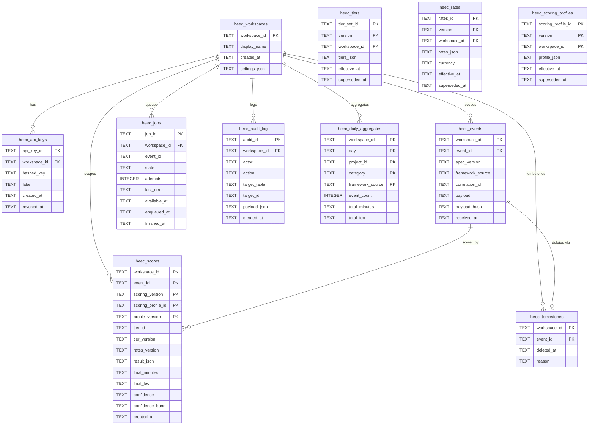

# Data model

> Status: foundation slice. Updated each plan increment.
> Last reviewed: 2026-04-24. Owner: Tech Lead + Security Engineer.

ai-heeczer uses an **append-only, workspace-scoped event and score model**.
Events are immutable once written; scores are immutable per `(workspace_id, event_id, scoring_version, scoring_profile_id, profile_version)`.
Re-scoring inserts a new row rather than updating an old one.
Hard-deletion honors data-subject requests via the `heec_tombstones` table without breaking
the immutability of the raw event log.

Two storage backends share one migration history:

| Backend    | Use case              | Dialect notes                                    |
| ---------- | --------------------- | ------------------------------------------------ |
| SQLite     | Local development, CLI | `strftime` timestamps, trigger-based guards      |
| PostgreSQL | Production             | `NOW()` defaults, PL/pgSQL trigger functions     |

References: [ADR-0004](../adr/0004-database-migration-tooling.md), [plan 0003](../plan/0003-storage-and-migrations.md)

---

## Table catalog

All table names carry the `heec_` prefix (the implementation prefix; plan 0003 and PRD §20 use the `aih_` logical name — these map 1-to-1).

| Table                      | Purpose                                                  |
| -------------------------- | -------------------------------------------------------- |
| `heec_workspaces`          | Tenant root; every other table FK's to this              |
| `heec_api_keys`            | Per-workspace hashed API keys with revocation            |
| `heec_events`              | Append-only normalized events, keyed by `(workspace_id, event_id)` |
| `heec_scores`              | Append-only scored results, versioned per scoring config |
| `heec_jobs`                | Queue rows for async/image-mode workers (ADR-0006)       |
| `heec_tiers`               | Append-only tier sets with `effective_at` ranges         |
| `heec_rates`               | Append-only rate tables with `effective_at` ranges       |
| `heec_scoring_profiles`    | Append-only profiles with `effective_at` ranges          |
| `heec_audit_log`           | Every config change and re-scoring event (PRD §22.5)     |
| `heec_daily_aggregates`    | Derived rollups (workspace, day, project, category)      |
| `heec_tombstones`          | Hard-deletion records (PRD §12.17); raw event survives   |
| `heec_schema_migrations`   | View over `_sqlx_migrations`; stable public contract     |

---

## Entity-relationship diagram



---

## Key design decisions

### Append-only enforcement

`heec_events`, `heec_scores`, and `heec_audit_log` carry `BEFORE UPDATE` and `BEFORE DELETE`
triggers that call `RAISE(ABORT, ...)` (SQLite) or `RAISE EXCEPTION` (PostgreSQL).
This makes accidental mutation fail loudly at the database level, independent of
application logic.

Re-scoring inserts a new `heec_scores` row with a different `scoring_version`
or `scoring_profile_id` — it never touches the prior row.

### Composite primary key for scores

```
PRIMARY KEY (workspace_id, event_id, scoring_version, scoring_profile_id, profile_version)
```

Each component of the key answers a distinct reproducibility question:

| Column               | Question answered                                    |
| -------------------- | ---------------------------------------------------- |
| `workspace_id`       | Which tenant produced this score?                    |
| `event_id`           | Which event was scored?                              |
| `scoring_version`    | Which engine version ran?                            |
| `scoring_profile_id` | Which profile (component weights, multipliers) ran?  |
| `profile_version`    | Which revision of that profile was active?           |

### Nullable `workspace_id` on config tables

`heec_scoring_profiles`, `heec_tiers`, and `heec_rates` allow a `NULL` `workspace_id`
to represent a **global (system-default) row**. SQLite treats two `NULL` values as
distinct in a `PRIMARY KEY`, creating a hole where two identical global rows can
coexist. Migration `0002` closes this with expression indexes:

```sql
CREATE UNIQUE INDEX uq_heec_scoring_profiles_global
    ON heec_scoring_profiles (scoring_profile_id, version, COALESCE(workspace_id, ''));
```

The same `COALESCE` sentinel works on PostgreSQL, keeping both dialects identical.

### Migration history view

`sqlx::migrate!` manages `_sqlx_migrations` internally. Rather than exposing
that implementation detail, migration `0001` creates:

```sql
CREATE VIEW heec_schema_migrations AS
    SELECT version, description, installed_on, success
    FROM _sqlx_migrations;
```

SDKs and the dashboard query `heec_schema_migrations`. The view is the contract;
`_sqlx_migrations` is an implementation detail of ADR-0004.

---

## Multi-tenancy

Every query that touches tenant data **must** carry a `workspace_id` parameter.
The repository layer wraps raw `String` IDs in a `WorkspaceId` newtype at the
type level so missing scopes are a compile error.

Tenant isolation checklist for new queries:

1. `WHERE workspace_id = $1` on every `SELECT`, `INSERT`, and `UPDATE`.
2. Foreign-key cascades in the schema prevent orphan rows but do not substitute for explicit scoping in reads.
3. `heec_audit_log` entries record the acting workspace even for global config changes.

---

## Migration authoring guide

### File naming

Migrations are **forward-only, sequentially numbered**:

```
core/heeczer-storage/migrations/          ← SQLite dialect
    0001_init.sql
    0002_append_only_audit_and_global_unique.sql
    <NNNN>_<slug>.sql

core/heeczer-storage/migrations-pg/       ← PostgreSQL dialect
    0001_init.sql
    0002_append_only_audit_and_global_unique.sql
    <NNNN>_<slug>.sql
```

The `<NNNN>` counter must match between the two trees. Gaps are not allowed.

### Adding a new migration

1. Pick the next integer (e.g., `0003`).
2. Author `migrations/0003_<slug>.sql` for SQLite. Use:
   - `strftime('%Y-%m-%dT%H:%M:%fZ', 'now')` for timestamps (not `CURRENT_TIMESTAMP`)
   - `TEXT` for all temporal columns (ISO-8601 strings)
   - `RAISE(ABORT, '...')` in `BEFORE UPDATE/DELETE` triggers
3. Author `migrations-pg/0003_<slug>.sql` for PostgreSQL. Use:
   - `NOW()` for timestamps
   - `TIMESTAMPTZ` for temporal columns
   - PL/pgSQL `CREATE FUNCTION` + `CREATE TRIGGER` for append-only guards
4. Run `heec migrate up` locally against both backends.
5. Add or update tests in `core/heeczer-storage/tests/` to cover new tables.
6. The `migration.yml` CI workflow validates fresh-install and incremental-upgrade on both backends.

### Dialect portability rules

Stick to this portable subset whenever possible:

- `CREATE TABLE`, `CREATE INDEX`, `CREATE UNIQUE INDEX`, `CREATE VIEW`
- `INTEGER`, `TEXT` column types (SQLite) / `BIGINT`, `TEXT`, `TIMESTAMPTZ` (PostgreSQL)
- `PRIMARY KEY (col1, col2, ...)` composite keys
- `FOREIGN KEY ... REFERENCES ... ON DELETE CASCADE`
- `CHECK (col IN ('a', 'b', 'c'))` constraints

Diverge only where unavoidable (trigger syntax, `COALESCE` in indexes, `CONCURRENTLY` for PostgreSQL online builds). Mark divergent blocks with a `-- dialect: sqlite` or `-- dialect: pg` comment.

### What you must not do

- Do not use `ALTER TABLE ... DROP COLUMN` on SQLite (not supported before SQLite 3.35, and not safe to assume in all CI images).
- Do not `UPDATE` or `DELETE` from append-only tables in a migration — use a new insert + tombstone instead.
- Do not reference `_sqlx_migrations` directly from application code; use the `heec_schema_migrations` view.
