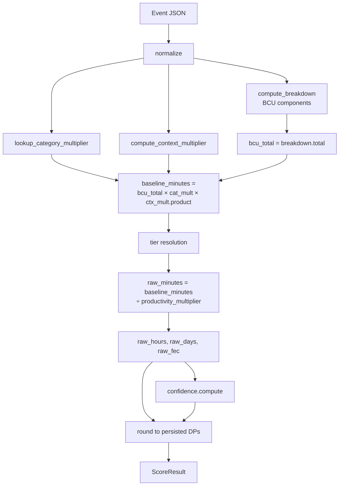

# Scoring engine

> Status: foundation slice. Updated each plan increment.
> Last reviewed: 2026-04-24. Owner: Tech Lead.

`heeczer-core` is the single source of truth for all scoring logic.
SDKs (Rust, JS, Python, Go, Java) and the ingestion service all consume its
output — they never recompute scores independently.

Key properties:

- **Deterministic.** Same input always produces byte-identical output, regardless of language or environment.
- **Fixed-point.** All intermediate arithmetic uses `rust_decimal`; `f32`/`f64` are banned in scoring code.
- **Versioned.** Every persisted `ScoreResult` embeds `SCORING_VERSION` so historical scores are always reproducible.

Public API (see `core/heeczer-core/src/scoring.rs`):

```rust
pub fn score(
    event: &Event,
    profile: &ScoringProfile,
    tiers: &TierSet,
    tier_override: Option<&str>,
) -> Result<ScoreResult>
```

References: [ADR-0001](../adr/0001-rust-core-engine.md), [ADR-0003](../adr/0003-scoring-versioning.md), [plan 0002](../plan/0002-scoring-core.md)

---

## Scoring pipeline



---

## BCU component breakdown (PRD §14.2)

The Behavioural Complexity Unit (BCU) is the intermediate measure before tier and rate adjustments.
Each component maps one normalized field to a weighted scalar:

| Component   | Formula                                                       | Notes                                        |
| ----------- | ------------------------------------------------------------- | -------------------------------------------- |
| `tokens`    | `total_tokens / token_divisor`                                | `total_tokens = tokens_prompt + tokens_completion` |
| `duration`  | `duration_seconds / duration_seconds_divisor`                 |                                              |
| `steps`     | `workflow_steps × step_weight`                                |                                              |
| `tools`     | `tool_call_count × tool_weight`                               |                                              |
| `artifacts` | `min(artifact_count, artifact_cap) × artifact_weight`         | Cap prevents outliers from dominating        |
| `output`    | `output_size_proxy × output_weight`                           | `output_weight` is category-specific; fallback to `output_default_weight` |
| `review`    | `review_weight` if `review_required`, else `0`                | `review_weight` is category-specific         |

All divisors and weights are read from the active `ScoringProfile`; they are not hard-coded in the engine.

**Total BCU:**

$$
\text{BCU total} = \text{tokens} + \text{duration} + \text{steps} + \text{tools} + \text{artifacts} + \text{output} + \text{review}
$$

---

## Category multiplier (PRD §14.3)

A per-category scalar that stretches or shrinks the BCU total based on task complexity class.
Lookup order:

1. `profile.category_multipliers[normalized_category]`
2. `profile.category_multipliers["uncategorized"]`
3. `Decimal::ONE` (hard fallback)

$$
\text{baseline\_minutes} = \text{BCU total} \times \text{category\_mult} \times \text{context\_mult}
$$

---

## Context multiplier composition (PRD §14.4)

Five independent factors are multiplied together to form the context multiplier:

| Factor        | Formula                                                              | Behavior                                       |
| ------------- | -------------------------------------------------------------------- | ---------------------------------------------- |
| `retry`       | `clamp(1 + retries × retry_per_unit, 1, retry_cap)`                | Increases with retry count, bounded by cap     |
| `ambiguity`   | `ambiguity_high_temp` if `temperature > ambiguity_temp_threshold`, else `1` | Step function on temperature               |
| `risk`        | `risk_high \| risk_medium \| risk_low` depending on `risk_class`    | Three-tier lookup                              |
| `human_in_loop` | `human_in_loop` if HIL, else `1`                                  | Binary                                         |
| `outcome`     | `outcome.success \| outcome.partial_success \| outcome.failure \| outcome.timeout` | Four-outcome lookup             |

$$
\text{context\_mult} = \text{retry} \times \text{ambiguity} \times \text{risk} \times \text{human\_in\_loop} \times \text{outcome}
$$

---

## Tier adjustment and FEC (PRD §14.5–14.6)

After `baseline_minutes` is computed, tier resolution maps the event to a specific labor tier:

```
requested_tier = tier_override ?? event.identity.tier_id ?? "tier_mid_eng"
tier = tiers.resolve(requested_tier, "tier_mid_eng")
```

```
raw_minutes = baseline_minutes / productivity_multiplier   (treat 0 as 1)
raw_hours   = raw_minutes / 60
raw_days    = raw_hours / working_hours_per_day            (treat 0 as 8)
raw_fec     = raw_hours × hourly_rate                      ← Financial Equivalent Cost
```

The Human Effort Equivalent (HEE) is expressed in `final_minutes`, `estimated_hours`, and `estimated_days`.

---

## Rounding

A single `round()` helper is applied **once**, at the persisted-output boundary.
It uses `MidpointAwayFromZero` and rescales to exactly `dp` decimal places so
the stored string representation is canonical:

```rust
fn round(v: Decimal, dp: u32) -> Decimal {
    let mut out = v.round_dp_with_strategy(dp, RoundingStrategy::MidpointAwayFromZero);
    out.rescale(dp);  // ensures trailing zeros are explicit
    out
}
```

Rounding settings per `ScoringProfile.rounding`:

| Field            | Default DPs | Stored as     |
| ---------------- | ----------- | ------------- |
| `minutes_dp`     | 4           | Decimal TEXT  |
| `hours_dp`       | 4           | Decimal TEXT  |
| `days_dp`        | 4           | Decimal TEXT  |
| `fec_dp`         | 4           | Decimal TEXT  |
| `confidence_dp`  | 4           | Decimal TEXT  |

No intermediate result is rounded. Only the five output fields carry the rounding boundary.

---

## Confidence model (PRD §15)

`confidence::compute()` returns an unrounded score in `[params.min, params.max]`.

### Penalty accumulation

Starting from `params.base`:

| Condition                      | Adjustment                                             |
| ------------------------------ | ------------------------------------------------------ |
| `category_was_missing`         | `− missing_category_penalty`                           |
| `tokens_were_missing`          | `− missing_tokens_penalty`                             |
| `steps_were_missing`           | `− missing_steps_penalty`                              |
| `tools_were_missing`           | `− missing_tools_penalty`                              |
| Retry count > 0                | `− min(retries × retry_penalty_per_unit, retry_penalty_cap)` |

### Risk cap

If `risk_class == High` and the running score exceeds `high_risk_cap`,
the score is clamped to `high_risk_cap`. The cap is applied after all penalties.

### Confidence band derivation

Bands are derived from the **unrounded** score:

| Band       | Score range          |
| ---------- | -------------------- |
| `High`     | `[0.85, 1.00]`       |
| `Medium`   | `[0.60, 0.84]`       |
| `Low`      | `[0.40, 0.59]`       |
| `VeryLow`  | `[0.00, 0.39]`       |

---

## Explainability trace (PRD §16)

`ScoreResult` is the explainability trace. Every field that contributed to the
final number is present:

```
ScoreResult {
    scoring_version,          // "1.0.0"
    spec_version,             // "1.0"
    scoring_profile,          // profile_id string
    bcu_breakdown {           // one Decimal per component
        tokens, duration, steps, tools, artifacts, output, review
    },
    category,
    category_multiplier,
    context_multiplier {      // five factors + their product
        retry, ambiguity, risk, human_in_loop, outcome
    },
    baseline_human_minutes,   // pre-tier baseline
    tier {
        id, multiplier, hourly_rate, currency
    },
    final_estimated_minutes,
    estimated_hours,
    estimated_days,
    financial_equivalent_cost,
    confidence_score,
    confidence_band,
    human_summary,            // plain-English one-liner
}
```

`human_summary` is a single sentence built from `final_minutes`, `fec`, `tier.display_name`,
and `confidence_band`, suitable for display in the dashboard or a CLI response.

---

## Determinism guarantees

1. **No floating-point math.** `rust_decimal` performs all arithmetic. `f32`/`f64` are banned via `clippy.toml`.
2. **Single rounding boundary.** `round()` is called exactly once per output field, at the end of `score()`.
3. **Profile-driven constants.** All weights, divisors, caps, and multipliers come from the serialized `ScoringProfile`. No magic constants in engine code.
4. **Version embedding.** `SCORING_VERSION` and `SPEC_VERSION` are baked into every `ScoreResult`, so any persisted score is self-describing.
5. **Golden fixture suite.** `core/heeczer-core/tests/golden_scoring.rs` asserts byte-identical output for hand-computed PRD §29 cases; CI fails if a code change silently alters any fixture.

---

## Versioning (ADR-0003)

### Constants (`core/heeczer-core/src/version.rs`)

```rust
pub const SPEC_VERSION: &str = "1.0";       // event schema version
pub const SCORING_VERSION: &str = "1.0.0";  // engine version (semver)
```

### When to bump `SCORING_VERSION`

Bump `SCORING_VERSION` (at minimum a minor increment) whenever a change could
alter a persisted `Decimal` output value. Examples:

- Any formula coefficient, divisor, weight, or cap change
- Any rounding strategy or `dp` value change
- Any normalization default change (e.g., the fallback tier string)
- Any new BCU component

Do **not** bump for purely structural changes (field renaming, new non-numeric fields)
unless they change computed values.

### Golden fixture update procedure

1. Make the formula change.
2. Run `cargo test -p heeczer-core` — golden tests will fail and print the diff.
3. Update each fixture file under `core/schema/fixtures/scoring/` to match the new output.
4. Bump `SCORING_VERSION` in `core/heeczer-core/src/version.rs`.
5. Amend [ADR-0003](../adr/0003-scoring-versioning.md) with the rationale and the new version number.
6. Include a `BREAKING CHANGE:` note in the conventional commit message so `release-please` flags it.
